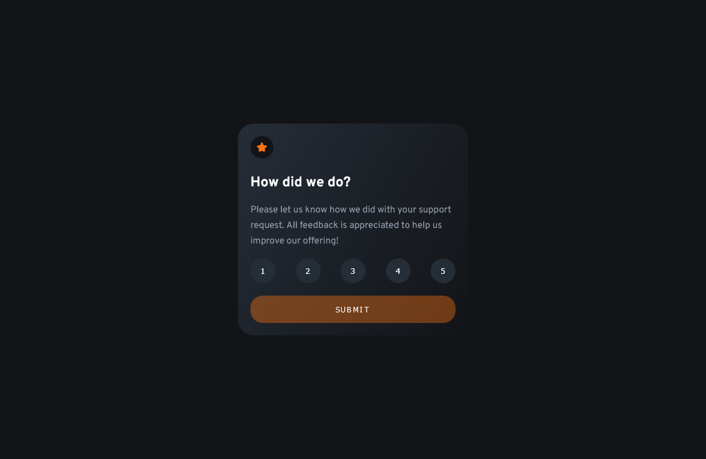

# Frontend Mentor - Interactive rating component solution

This is a solution to the [Interactive rating component challenge on Frontend Mentor](https://www.frontendmentor.io/challenges/interactive-rating-component-koxpeBUmI). Frontend Mentor challenges help you improve your coding skills by building realistic projects.

## Table of contents

- [Overview](#overview)
  - [The challenge](#the-challenge)
  - [Screenshot](#screenshot)
  - [Links](#links)
- [My process](#my-process)
  - [Built with](#built-with)
  - [What I learned](#what-i-learned)
- [Author](#author)

## Overview

### The challenge

Users should be able to:

- View the optimal layout for the app depending on their device's screen size
- See hover states for all interactive elements on the page
- Select and submit a number rating
- See the "Thank you" card state after submitting a rating

### Screenshot



### Links

- Solution URL: [Solution URL here](https://www.frontendmentor.io/solutions/html-css-flexbox-javascript-7lmSISfZd)
- Live Site URL: [Live site URL here](https://intreractive-rating-component.vercel.app/)

## My process

### Built with

- Semantic HTML5 markup
- CSS custom properties
- JavaScript
- Flexbox
- Mobile-first workflow

### What I learned

- I have practiced my JavaScript skills to switch between two cards.
- I learned that I have to use the **pointer-event: none** in the submit button so that the hover state is working when the button is disabled.

```css
.submit-btn:disabled {
  background-color: hsl(25, 97%, 53%, 40%);
  pointer-events: none;
}
```

- I noticed in Firefox that when I load the page the **disabled** default state of the button is not set to be true so I had to make it disabled on load:

```js
window.onload = () => {
  submit.disabled = true
}
```

## Author

- Website - [Mohanad Alrwaihy](https://mohanad-portfolio.pages.dev/)
- Frontend Mentor - [@MohanadOO](https://www.frontendmentor.io/profile/MohanadOO)
